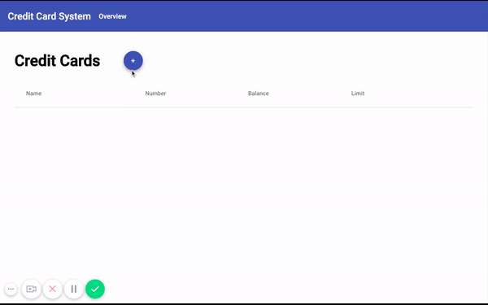

## Credit Card Demo Application
Simple Credit Card Management Application

[Live Demo on Google Cloud Platform](https://credit-card-system-client-1.appspot.com)



### Prerequsites
1. The latest versions of **Java8**, **Maven** and **NodeJs** must be installed on your system. 
    
    Homebrew users use:
    ```bash
    brew cask install java8
    brew install maven
    brew install node
    ```
2. Install Angular CLI
```
npm install -g @angular/cli
```

### Run Server
```bash
cd server
mvn spring-boot:run -Dspring-boot.run.arguments=--server.port=3000
```

### Run Client
```bash
cd client
ng serve --open
```